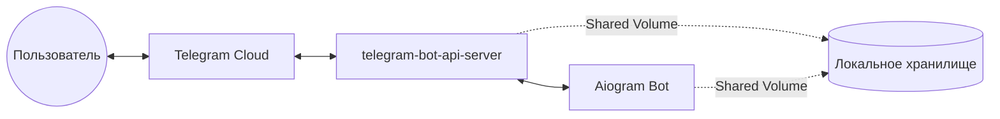

# Архитектурный план: Переход на локальный Telegram Bot API

Данный план описывает изменения, необходимые для поддержки загрузки файлов до 2000 МБ путем внедрения локального сервера `telegram-bot-api`.

## 1. Схема Docker-архитектуры

Будет использован `docker-compose.yml` для запуска двух связанных контейнеров:
- `bot`: Контейнер с приложением бота.
- `telegram-api`: Локальный сервер Telegram Bot API.

Оба контейнера будут использовать общий Volume для прямого доступа к файлам.



### Изменения в `docker-compose.yml`:
- Добавление сервиса `telegram-api` (образ `aiogram/telegram-bot-api` или аналогичный).
- Настройка `volumes` для обоих сервисов, чтобы `telegram-api` сохранял файлы в директорию, доступную боту.
- Проброс `API_ID` и `API_HASH` (требуются для локального сервера).

## 2. Изменения в коде бота

### `config.py`
- Добавление переменных:
    - `TELEGRAM_API_URL` (по умолчанию `http://telegram-api:8081`)
    - `TELEGRAM_API_ID`
    - `TELEGRAM_API_HASH`
    - `LOCAL_MODE` (флаг для переключения между облачным и локальным API)

### `main.py`
- Настройка `Bot` для работы с локальным сервером:
  ```python
  from aiogram.client.telegram import TelegramAPIServer
  
  if LOCAL_MODE:
      bot = Bot(
          token=BOT_TOKEN,
          session=AiohttpSession(api=TelegramAPIServer.from_base(TELEGRAM_API_URL)),
          ...
      )
  ```

### `handlers/user_handlers.py`
- Оптимизация скачивания: при использовании локального сервера `bot.get_file` возвращает объект, содержащий локальный путь. Бот сможет читать файл напрямую с диска, не скачивая его по HTTP.

## 3. Обновление Dockerfile
- Настройка прав доступа к общей директории с файлами.

## 4. Автоматизация обновлений
- Создание bash-скрипта `deploy.sh` для:
    1. `git pull`
    2. `docker-compose up -d --build`
- Настройка `crontab` или использование GitHub Actions (если есть доступ к серверу) для автоматического запуска скрипта.

## 5. План реализации (TODO для Code Mode)

1. [ ] Обновить `.env.example` (добавить API_ID, API_HASH, API_URL).
2. [ ] Изменить `config.py` для загрузки новых переменных.
3. [ ] Модернизировать `docker-compose.yml` (добавить сервис API, настроить сети и тома).
4. [ ] Обновить `main.py` для поддержки `TelegramAPIServer`.
5. [ ] В `handlers/user_handlers.py` реализовать логику чтения файлов напрямую из локального тома при включенном локальном режиме.
6. [ ] Подготовить скрипт `deploy.sh`.

---
**Вопросы к пользователю:**
1. Есть ли у вас уже полученные `API_ID` и `API_HASH` с [my.telegram.org](https://my.telegram.org)? (Если нет, их нужно будет получить).
2. Какой объем дискового пространства доступен на сервере? (Файлы до 2ГБ могут быстро забить диск).
3. Нужна ли автоматическая очистка скачанных файлов через определенное время?
