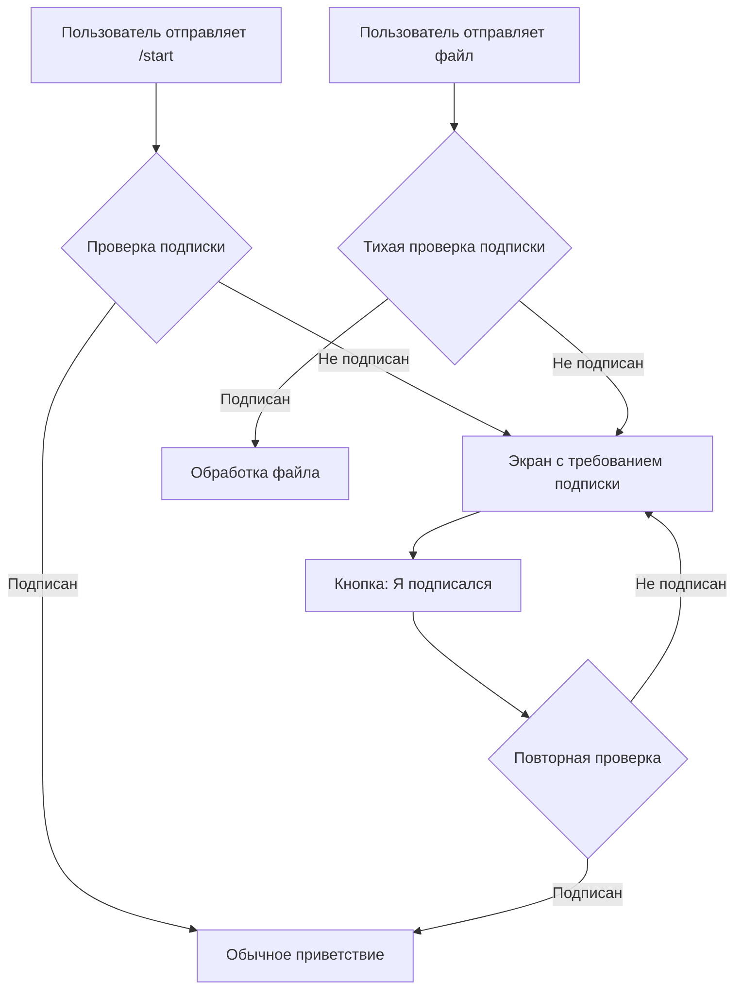
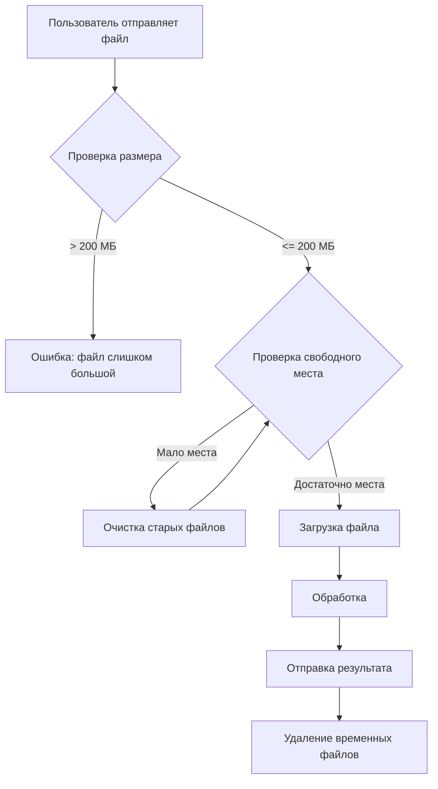
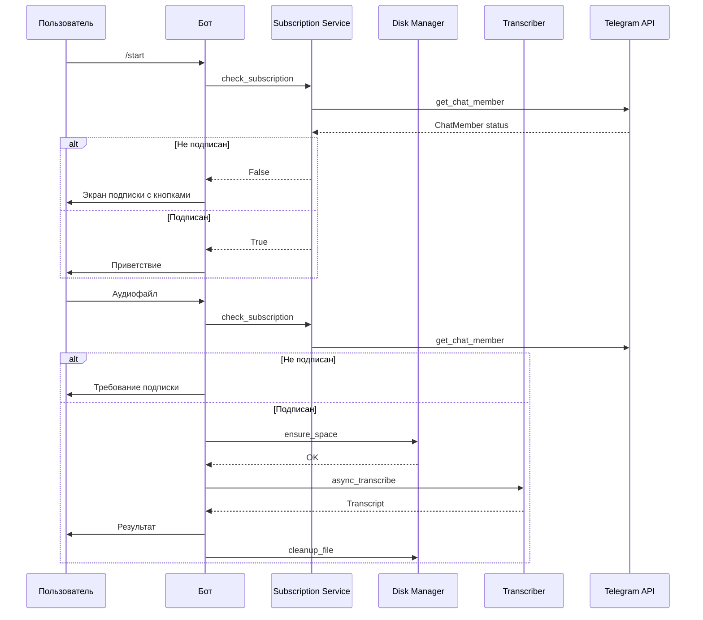
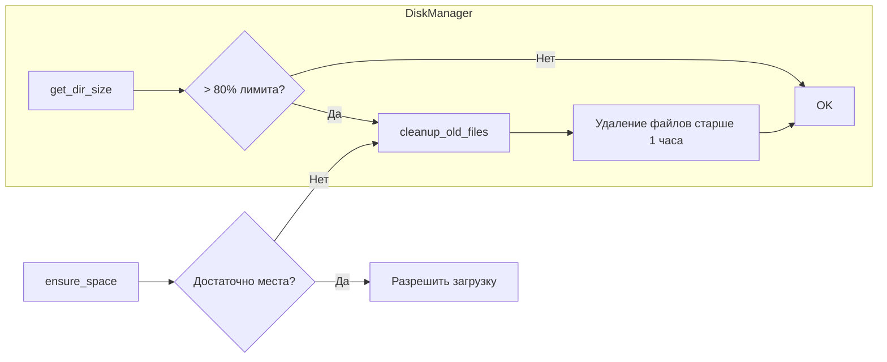

# План: Система проверки подписки и обработки больших файлов

## Содержание
1. [Архитектура проверки подписки](#1-архитектура-проверки-подписки)
2. [Архитектура обработки больших файлов](#2-архитектура-обработки-больших-файлов)
3. [Изменения в файлах](#3-изменения-в-файлах)
4. [Диаграммы](#4-диаграммы)

---

## 1. Архитектура проверки подписки

### 1.1 Общий подход



### 1.2 Механизм проверки через Telegram API

Используем метод `get_chat_member`:

```python
# Пример реализации
async def check_subscription(bot: Bot, user_id: int) -> bool:
    try:
        member = await bot.get_chat_member(chat_id=CHANNEL_ID, user_id=user_id)
        # Статусы, которые считаются подписанными
        subscribed_statuses = {'member', 'administrator', 'creator'}
        return member.status in subscribed_statuses
    except Exception as e:
        logger.error(f"Error checking subscription: {e}")
        return False
```

**Важные статусы участников:**
- `creator` - создатель канала
- `administrator` - администратор
- `member` - обычный участник (подписан)
- `left` - покинул канал
- `kicked` - заблокирован
- `restricted` - ограничен

### 1.3 UX сценарий

1. **Первый запуск (/start):**
   - Проверяем подписку через `get_chat_member`
   - Если не подписан → показываем сообщение с кнопкой на канал и кнопкой "Я подписался"
   - Если подписан → обычное приветствие

2. **Тихая проверка перед транскрибацией:**
   - При получении файла проверяем подписку
   - Если не подписан → перенаправляем на экран подписки
   - Если подписан → продолжаем обработку

### 1.4 Хранение информации о подписке

**Вариант 1: Без хранения (рекомендуется)**
- Проверяем подписку в реальном времени через API
- Плюсы: всегда актуальные данные
- Минусы: дополнительный запрос к API

**Вариант 2: Кэширование в БД**
- Добавляем поле `subscription_checked_at` в таблицу users
- Кэш действует N часов (например, 24)
- Плюсы: меньше запросов к API
- Минусы: может быть неактуально

**Рекомендация:** Использовать Вариант 1 для надежности, так как проверка подписки - быстрый запрос.

---

## 2. Архитектура обработки больших файлов

### 2.1 Общий подход



### 2.2 Лимиты и проверки

**Проверка размера файла:**
```python
MAX_FILE_SIZE_MB = 200
MAX_FILE_SIZE_BYTES = MAX_FILE_SIZE_MB * 1024 * 1024  # 200 МБ

# При получении файла
file_size = message.document.file_size or message.audio.file_size or ...
if file_size > MAX_FILE_SIZE_BYTES:
    await message.answer("❌ Файл слишком большой. Максимум: 200 МБ")
    return
```

### 2.3 Механизм очистки временных файлов

**Стратегия:**
1. **Немедленная очистка** - удаление после обработки
2. **Периодическая очистка** - по расписанию или при нехватке места
3. **Защита от переполнения** - проверка перед загрузкой

**Реализация сервиса очистки:**

```python
# services/cleanup.py
import os
import shutil
import asyncio
from datetime import datetime, timedelta

class DiskManager:
    def __init__(self, download_dir: str, max_storage_gb: float = 10):
        self.download_dir = download_dir
        self.max_storage_bytes = max_storage_gb * 1024 ** 3
        self.warning_threshold = 0.8  # 80%
    
    def get_dir_size(self) -> int:
        """Возвращает размер директории в байтах"""
        total = 0
        for entry in os.scandir(self.download_dir):
            if entry.is_file():
                total += entry.stat().st_size
        return total
    
    def get_free_space(self) -> int:
        """Возвращает свободное место на диске"""
        stat = shutil.disk_usage(self.download_dir)
        return stat.free
    
    async def cleanup_old_files(self, max_age_hours: int = 1):
        """Удаляет файлы старше указанного возраста"""
        now = datetime.now()
        cleaned = 0
        
        for entry in os.scandir(self.download_dir):
            if entry.is_file():
                mtime = datetime.fromtimestamp(entry.stat().st_mtime)
                age = now - mtime
                if age > timedelta(hours=max_age_hours):
                    os.remove(entry.path)
                    cleaned += entry.stat().st_size
        
        return cleaned
    
    async def ensure_space(self, required_bytes: int) -> bool:
        """Гарантирует наличие места для файла"""
        current_size = self.get_dir_size()
        
        # Если превысили лимит - очищаем
        if current_size + required_bytes > self.max_storage_bytes:
            await self.cleanup_old_files(max_age_hours=0)  # Удаляем все старые
            
        # Проверяем свободное место на диске
        free_space = self.get_free_space()
        if free_space < required_bytes * 1.1:  # 10% запас
            await self.cleanup_old_files(max_age_hours=0)
            free_space = self.get_free_space()
            
        return free_space >= required_bytes
```

### 2.4 Защита от переполнения диска (VDS 15 ГБ)

**Рекомендуемые лимиты:**
- Максимальный размер файлов в работе: 10 ГБ
- Резерв для системы: 5 ГБ
- Порог очистки: 80% от лимита

**Алгоритм:**
1. Перед загрузкой файла проверить:
   - Размер файла <= 200 МБ
   - Текущий размер директории + размер файла <= 10 ГБ
   - Свободное место на диске >= размер файла * 1.1
2. Если условия не выполнены → запустить очистку
3. Если после очистки места недостаточно → отказать в обработке

---

## 3. Изменения в файлах

### 3.1 config.py

```python
# Добавить:

# Channel subscription settings
CHANNEL_ID = os.getenv("CHANNEL_ID", "@e_mysienko")
CHANNEL_URL = os.getenv("CHANNEL_URL", "https://t.me/e_mysienko")

# File size limits
MAX_FILE_SIZE_MB = int(os.getenv("MAX_FILE_SIZE_MB", "200"))
MAX_FILE_SIZE_BYTES = MAX_FILE_SIZE_MB * 1024 * 1024

# Disk management
MAX_STORAGE_GB = float(os.getenv("MAX_STORAGE_GB", "10"))
DOWNLOAD_DIR = os.getenv("DOWNLOAD_DIR", "downloads")
```

### 3.2 database.py

```python
# Добавить в таблицу users новое поле:

# В функции init_db():
cursor.execute('''
    CREATE TABLE IF NOT EXISTS users (
        user_id INTEGER PRIMARY KEY,
        balance_seconds INTEGER DEFAULT 0,
        free_minutes_used INTEGER DEFAULT 0,
        last_free_reset_month TEXT,
        subscription_checked_at TEXT  -- НОВОЕ ПОЛЕ: ISO timestamp последней проверки
    )
''')

# Добавить функцию для кэширования (опционально):
def update_subscription_check(user_id: int):
    conn = sqlite3.connect(DB_FILE)
    cursor = conn.cursor()
    now = datetime.datetime.now().isoformat()
    cursor.execute('''
        UPDATE users SET subscription_checked_at = ? WHERE user_id = ?
    ''', (now, user_id))
    conn.commit()
    conn.close()
```

### 3.3 services/subscription.py (НОВЫЙ ФАЙЛ)

```python
import logging
from aiogram import Bot
from config import CHANNEL_ID

logger = logging.getLogger(__name__)

SUBSCRIBED_STATUSES = {'member', 'administrator', 'creator'}

async def check_subscription(bot: Bot, user_id: int) -> bool:
    """
    Проверяет подписку пользователя на канал.
    
    Returns:
        True если пользователь подписан, False иначе
    """
    try:
        member = await bot.get_chat_member(chat_id=CHANNEL_ID, user_id=user_id)
        return member.status in SUBSCRIBED_STATUSES
    except Exception as e:
        logger.error(f"Error checking subscription for user {user_id}: {e}")
        # В случае ошибки разрешаем доступ (fail-open)
        return True
```

### 3.4 services/cleanup.py (НОВЫЙ ФАЙЛ)

```python
import os
import shutil
import logging
from datetime import datetime, timedelta
from config import DOWNLOAD_DIR, MAX_STORAGE_GB

logger = logging.getLogger(__name__)

class DiskManager:
    def __init__(self):
        self.download_dir = DOWNLOAD_DIR
        self.max_storage_bytes = MAX_STORAGE_GB * 1024 ** 3
        os.makedirs(self.download_dir, exist_ok=True)
    
    def get_dir_size(self) -> int:
        """Возвращает размер директории в байтах"""
        if not os.path.exists(self.download_dir):
            return 0
        return sum(
            entry.stat().st_size 
            for entry in os.scandir(self.download_dir) 
            if entry.is_file()
        )
    
    def get_free_space(self) -> int:
        """Возвращает свободное место на диске в байтах"""
        stat = shutil.disk_usage(self.download_dir)
        return stat.free
    
    def cleanup_old_files(self, max_age_hours: int = 1) -> int:
        """
        Удаляет файлы старше указанного возраста.
        Возвращает освобожденное количество байт.
        """
        if not os.path.exists(self.download_dir):
            return 0
            
        now = datetime.now()
        cleaned = 0
        
        for entry in os.scandir(self.download_dir):
            if entry.is_file():
                mtime = datetime.fromtimestamp(entry.stat().st_mtime)
                age = now - mtime
                if age > timedelta(hours=max_age_hours):
                    try:
                        size = entry.stat().st_size
                        os.remove(entry.path)
                        cleaned += size
                        logger.info(f"Cleaned up old file: {entry.path}")
                    except Exception as e:
                        logger.error(f"Failed to remove {entry.path}: {e}")
        
        return cleaned
    
    def ensure_space(self, required_bytes: int) -> tuple[bool, str]:
        """
        Гарантирует наличие места для файла.
        
        Returns:
            (success, message) - успешность и сообщение
        """
        # Проверка лимита директории
        current_size = self.get_dir_size()
        if current_size + required_bytes > self.max_storage_bytes:
            cleaned = self.cleanup_old_files(max_age_hours=0)
            logger.info(f"Cleaned {cleaned} bytes to make space")
        
        # Проверка свободного места на диске
        free_space = self.get_free_space()
        required_with_buffer = required_bytes * 1.1  # 10% запас
        
        if free_space < required_with_buffer:
            self.cleanup_old_files(max_age_hours=0)
            free_space = self.get_free_space()
            
            if free_space < required_with_buffer:
                return False, f"Недостаточно места на диске. Требуется: {required_bytes // 1024 // 1024} МБ"
        
        return True, "OK"
    
    def cleanup_file(self, file_path: str):
        """Безопасное удаление файла"""
        try:
            if os.path.exists(file_path):
                os.remove(file_path)
                logger.info(f"Removed file: {file_path}")
        except Exception as e:
            logger.error(f"Failed to remove {file_path}: {e}")

# Глобальный экземпляр
disk_manager = DiskManager()
```

### 3.5 keyboards/inline.py

```python
# Добавить новые клавиатуры:

def get_subscription_keyboard(channel_url: str) -> InlineKeyboardMarkup:
    """Клавиатура для экрана подписки"""
    return InlineKeyboardMarkup(
        inline_keyboard=[
            [InlineKeyboardButton(text="📢 Подписаться на канал", url=channel_url)],
            [InlineKeyboardButton(text="✅ Я подписался", callback_data="check_subscription")]
        ]
    )

def get_subscription_required_keyboard(channel_url: str) -> InlineKeyboardMarkup:
    """Клавиатура с требованием подписки"""
    return InlineKeyboardMarkup(
        inline_keyboard=[
            [InlineKeyboardButton(text="📢 Перейти в канал", url=channel_url)],
            [InlineKeyboardButton(text="🔄 Проверить подписку", callback_data="check_subscription")]
        ]
    )
```

### 3.6 handlers/user_handlers.py

**Основные изменения:**

1. **Импорты:**
```python
from services.subscription import check_subscription
from services.cleanup import disk_manager
from keyboards.inline import get_subscription_keyboard, get_subscription_required_keyboard
from config import CHANNEL_ID, CHANNEL_URL, MAX_FILE_SIZE_BYTES
```

2. **Модификация cmd_start:**
```python
@router.message(CommandStart(), StateFilter("*"))
async def cmd_start(message: Message, state: FSMContext, bot: Bot):
    await state.clear()
    db.get_user(message.from_user.id)
    
    # Проверка подписки
    is_subscribed = await check_subscription(bot, message.from_user.id)
    
    if not is_subscribed:
        await message.answer(
            "👋 Для использования бота необходимо подписаться на канал!\n\n"
            "Подписка бесплатна и поддерживает развитие проекта.",
            reply_markup=get_subscription_keyboard(CHANNEL_URL)
        )
        return
    
    # Обычное приветствие
    text = (
        "Привет! Я бот для транскрибации аудио...\n\n"
        "⚡️ В данный момент бот работает полностью бесплатно!"
    )
    await message.answer(text)
```

3. **Новый обработчик для кнопки "Я подписался":**
```python
@router.callback_query(F.data == "check_subscription")
async def check_subscription_callback(callback: CallbackQuery, bot: Bot):
    is_subscribed = await check_subscription(bot, callback.from_user.id)
    
    if is_subscribed:
        await callback.message.edit_text(
            "✅ Подписка подтверждена!\n\n"
            "Теперь вы можете отправить аудиофайл для транскрибации."
        )
    else:
        await callback.answer(
            "❌ Вы еще не подписаны на канал. Подпишитесь и попробуйте снова.",
            show_alert=True
        )
```

4. **Модификация handle_audio:**
```python
@router.message(F.audio | F.voice | F.document | F.video | F.video_note, StateFilter("*"))
async def handle_audio(message: Message, state: FSMContext, bot: Bot):
    # Тихая проверка подписки
    is_subscribed = await check_subscription(bot, message.from_user.id)
    if not is_subscribed:
        await message.answer(
            "❌ Для использования бота необходима подписка на канал!",
            reply_markup=get_subscription_required_keyboard(CHANNEL_URL)
        )
        return
    
    # Проверка размера файла
    file_size = get_file_size(message)
    if file_size > MAX_FILE_SIZE_BYTES:
        await message.answer(
            f"❌ Файл слишком большой!\n\n"
            f"Размер файла: {file_size // 1024 // 1024} МБ\n"
            f"Максимум: {MAX_FILE_SIZE_BYTES // 1024 // 1024} МБ"
        )
        return
    
    # Проверка свободного места
    has_space, msg = disk_manager.ensure_space(file_size)
    if not has_space:
        await message.answer(f"❌ {msg}\n\nПопробуйте позже.")
        return
    
    # ... остальной код обработки
```

5. **Вспомогательная функция:**
```python
def get_file_size(message: Message) -> int:
    """Извлекает размер файла из сообщения"""
    if message.document:
        return message.document.file_size or 0
    elif message.audio:
        return message.audio.file_size or 0
    elif message.video:
        return message.video.file_size or 0
    elif message.video_note:
        return message.video_note.file_size or 0
    elif message.voice:
        return message.voice.file_size or 0
    return 0
```

6. **Обновление finally блока:**
```python
finally:
    # Используем disk_manager для очистки
    if 'file_path' in locals():
        disk_manager.cleanup_file(file_path)
    if 'result_path' in locals():
        disk_manager.cleanup_file(result_path)
    
    await state.clear()
```

### 3.7 .env.example

```bash
# Добавить:

# Channel for subscription check
CHANNEL_ID=@e_mysienko
CHANNEL_URL=https://t.me/e_mysienko

# File limits
MAX_FILE_SIZE_MB=200
MAX_STORAGE_GB=10
```

---

## 4. Диаграммы

### 4.1 Полная схема взаимодействия



### 4.2 Схема очистки диска



---

## 5. Рекомендации по API Telegram

### 5.1 Метод get_chat_member

**Документация:** https://core.telegram.org/bots/api#getchatmember

**Параметры:**
- `chat_id` - ID канала (например, `@e_mysienko` или `-1001234567890`)
- `user_id` - ID пользователя

**Возвращает:** Объект `ChatMember` с полем `status`

**Ограничения:**
- Бот должен быть администратором в канале
- Рейт-лимит: ~30 запросов/секунду

### 5.2 Рекомендации по реализации

1. **Кэширование:** Не обязательно, но можно добавить in-memory кэш на 5 минут
2. **Обработка ошибок:** При ошибке API разрешать доступ (fail-open)
3. **Рейт-лимит:** Не делать лишних запросов, проверять только когда нужно

---

## 6. Порядок реализации

1. ✅ Создать `services/subscription.py`
2. ✅ Создать `services/cleanup.py`
3. ✅ Обновить `config.py`
4. ✅ Обновить `keyboards/inline.py`
5. ✅ Обновить `handlers/user_handlers.py`
6. ✅ Обновить `.env.example`
7. ✅ Тестирование
